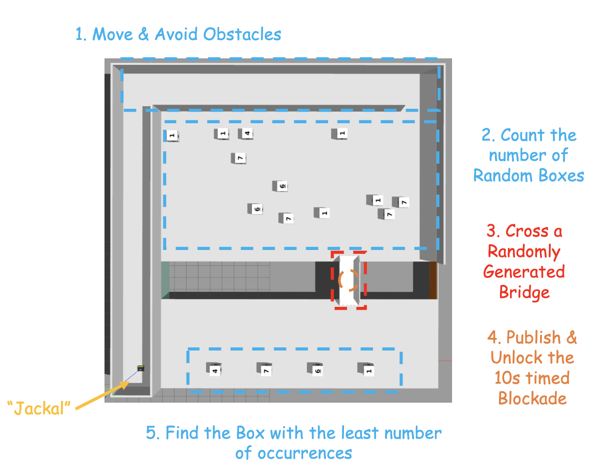

## ME5413 Final Project




## Dependencies

* System Requirements:
  * Ubuntu 20.04 (18.04 not yet tested)
  * ROS Noetic (Melodic not yet tested)
  * C++11 and above
  * CMake: 3.0.2 and above
* This repo depends on the following standard ROS pkgs:
  * `roscpp`
  * `rospy`
  * `rviz`
  * `std_msgs`
  * `nav_msgs`
  * `geometry_msgs`
  * `visualization_msgs`
  * `tf2`
  * `tf2_ros`
  * `tf2_geometry_msgs`
  * `pluginlib`
  * `map_server`
  * `gazebo_ros`
  * `jsk_rviz_plugins`
  * `jackal_gazebo`
  * `jackal_navigation`
  * `velodyne_simulator`
  * `teleop_twist_keyboard`
* And this [gazebo_model](https://github.com/osrf/gazebo_models) repositiory

## Installation

This repo is a ros workspace, containing three rospkgs:

* `interactive_tools` are customized tools to interact with gazebo and your robot
* `jackal_description` contains the modified jackal robot model descriptions
* `me5413_world` the main pkg containing the gazebo world, and the launch files

**Note:** If you are working on this project, it is encouraged to fork this repository and work on your own fork!

After forking this repo to your own github:

```bash
# Clone your own fork of this repo (assuming home here `~/`)
cd
git clone https://github.com/<YOUR_GITHUB_USERNAME>/ME5413_Final_Project.git
cd ME5413_Final_Project

# Install all dependencies
rosdep install --from-paths src --ignore-src -r -y

# Build
catkin_make
# Source 
source devel/setup.bash
```

To properly load the gazebo world, you will need to have the necessary model files in the `~/.gazebo/models/` directory.

There are two sources of models needed:

* [Gazebo official models](https://github.com/osrf/gazebo_models)
  
  ```bash
  # Create the destination directory
  cd
  mkdir -p .gazebo/models

  # Clone the official gazebo models repo (assuming home here `~/`)
  git clone https://github.com/osrf/gazebo_models.git

  # Copy the models into the `~/.gazebo/models` directory
  cp -r ~/gazebo_models/* ~/.gazebo/models
  ```

* [Our customized models](https://github.com/NUS-Advanced-Robotics-Centre/ME5413_Final_Project/tree/main/src/me5413_world/models)

  ```bash
  # Copy the customized models into the `~/.gazebo/models` directory
  cp -r ~/ME5413_Final_Project/src/me5413_world/models/* ~/.gazebo/models
  ```

## install Yolov8_ROS and the conda environment

# Prerequisites:

Pip install the ultralytics package including all [requirements](https://github.com/ultralytics/ultralytics/blob/main/requirements.txt) in a [**Python>=3.7**](https://www.python.org/) environment with [**PyTorch>=1.7**](https://pytorch.org/get-started/locally/).

```
pip install ultralytics
pip install rospkg
```
```bash
cd /your/catkin_ws/src

git clone https://github.com/qq44642754a/Yolov8_ros.git

cd ..

catkin_make

```
1.  make sure to put your weights in the [weights](https://github.com/qq44642754a/Yolov8_ros/tree/master/yolov8_ros/weights) folder. 
2.  The default settings (using `yolov8s.pt`) in the `launch/yolo_v8.launch` file should work, all you should have to do is change the image topic you would like to subscribe to:

```bash
roslaunch yolov8_ros yolo_v8.launch
```

## Usage

```bash
source ~/devel/setup.bash
```

### 0. Gazebo World

This command will launch the gazebo with the project world

```bash
# Launch Gazebo World together with our robot
roslaunch me5413_world world.launch
```
### 1. Once completed mapping and saved your map, then start the navigation.

The 2D map file is saved in the ~/me5413_world/maps/your map file
Then, in the second terminal:

```bash
# Load a map, launch AMCL localizer and global and local planner
roslaunch me5413_world navigation.launch
```

### 2. Start Yolo detection 

Notice that the weights file is under the  ./yolov8_ros/wights/ 

```bash
# Activate the conda env and load the trained weight file to start yolo detection
conda activate yolov5 && roslaunch yolov8_ros yolo_v8.launch
```

### 3. Run the count.py to count the number of different class

```bash
rosrun move_demo num_count.py 
```

### 4. Launch all the core nodes

The launch file is used to launch all the core nodes in the project with a single click to implement functions such as target recognition, bridge detection, coordinate conversion and master control logic.

```bash
roslaunch move_demo start_server.launch
```
